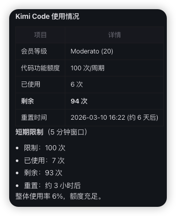

# kimi-code-usage-skill (Kimi Usage / Quota / Limit / Billing / Token Refresh)

`kimi-code-usage-skill` 是一个可复用的本地技能仓库，用于查询 Kimi Code usage / quota / limit / billing，并提供 token refresh（二维码登录刷新）能力。

本项目的目标是：
- 不依赖网页手工操作即可查询使用情况（登录除外）
- API 查询优先，自动输出统一 JSON
- 凭据本地安全存储（`~/.kimi/credentials/kimi-code.json`）
- 调试日志默认脱敏，避免泄漏 token

## 功能特性（Usage / Quota / Limit / Billing / Token Refresh）

- 真实查询入口（POST）
  - `POST /apiv2/kimi.gateway.billing.v1.BillingService/GetUsages`
  - 请求体：`{"scope":["FEATURE_CODING"]}`
- 二维码刷新登录
  - 自动打开登录页
  - 生成二维码截图，便于转发给客户扫码
  - 返回二维码剩余可扫码时间，便于远程提醒
  - 扫码成功后自动写入新 token
- 统一结构输出
  - 返回会员等级、周额度使用、频限窗口明细、重置时间（含小时）

## 目录结构

```text
.
├── SKILL.md
├── scripts/
│   ├── get_kimi_usage.sh
│   ├── refresh_kimi_token.sh
│   ├── bootstrap_kimi_login.sh
│   ├── parse_usage.py
│   └── browser/
│       └── wx-register-login.mjs
└── tests/
```

## 快速开始

## 安装方式

### 方式 1：用 Skills CLI 从 GitHub 安装（推荐）

先安装到全局（用户级）：

```bash
npx skills add <owner>/<repo> --skill kimi-code-usage -g -y
```

例如：

```bash
npx skills add dadazhang/kimi-code-usage-skill --skill kimi-code-usage -g -y
```

安装后建议重启 Codex / OpenClaw，或新开一个会话。

### 方式 2：本地软链安装（开发调试常用）

Agent skills 目录：

```bash
ln -sfn /绝对路径/kimi-code-usage-skill ~/.agents/skills/kimi-code-usage
```

Codex skills 目录（可选）：

```bash
ln -sfn /绝对路径/kimi-code-usage-skill ~/.codex/skills/kimi-code-usage
```

### 方式 3：让 Agent 大模型代你安装

你可以在对话里直接这样说：

```text
帮我安装 kimi-code-usage skill，来源是 <owner>/<repo>，用全局安装并跳过确认。
```

对应命令通常是：

```bash
npx skills add <owner>/<repo> --skill kimi-code-usage -g -y
```

如果你使用 OpenClaw，也可以让 agent 执行：

```bash
openclaw skills list
openclaw skills info kimi-code-usage
```

确认 skill 已被识别为 `Ready`。

### 1. 首次登录 / Token Refresh（二维码）

```bash
bash scripts/bootstrap_kimi_login.sh
```

或者直接执行刷新流程：

```bash
bash scripts/refresh_kimi_token.sh --refresh
```

远程场景（推荐两阶段）：

```bash
# 1) 生成二维码并立刻发送给发问会话
bash scripts/refresh_kimi_token.sh --prepare-qr

# 2) 轮询扫码状态（可周期性提醒剩余时间）
bash scripts/refresh_kimi_token.sh --poll-qr <login_id>
```

二维码截图默认路径：

`docs/screenshots/kimi-login-qr.png`

### 2. 查询 Usage / Quota / Limit / Billing

```bash
bash scripts/get_kimi_usage.sh
```

仅查询原始 API 返回：

```bash
bash scripts/get_kimi_usage.sh --api-only
```

### 3. 凭据检查（Token / Auth）

```bash
bash scripts/get_kimi_usage.sh --check-credentials
```

### 4. 调试（Debug + Token Redaction）

```bash
bash scripts/get_kimi_usage.sh --debug --api-only
```

## 输出示例（Usage / Quota / Limit）

```json
{
  "membership": "20",
  "membershipName": "Moderato",
  "usage": {
    "scope": "FEATURE_CODING",
    "limit": "100",
    "used": "6",
    "remaining": "94",
    "usedPercent": 6.0,
    "resetTime": "2026-03-10T16:22:47.523319Z",
    "resetInHours": 151.25
  },
  "limits": [
    {
      "windowSeconds": 300,
      "windowUnit": "TIME_UNIT_MINUTE",
      "limit": "100",
      "used": "5",
      "remaining": "95",
      "usedPercent": 5.0,
      "resetTime": "2026-03-04T12:22:47.523319Z",
      "resetInHours": 3.25
    }
  ],
  "source": "api"
}
```

### 使用后效果图



说明：
- `usage.usedPercent` 对应“本周用量百分比”
- `limits[*].usedPercent` 对应“频限明细百分比”
- `membership=20` 当前映射为 `membershipName=Moderato`，其他等级后续可扩展

## 安全说明

- 凭据只写入：`~/.kimi/credentials/kimi-code.json`
- 文件权限强制：`chmod 600`
- 调试日志中 token 始终脱敏，不输出完整值

## 验证命令

```bash
bash -n scripts/*.sh
bash tests/test_credentials.sh
bash tests/test_api_flow.sh
bash tests/test_fallback_mode.sh
bash tests/test_redaction.sh
python3 -m pytest tests -v
```

## 致谢

感谢参考项目：
- [robinebers/openusage](https://github.com/robinebers/openusage)
